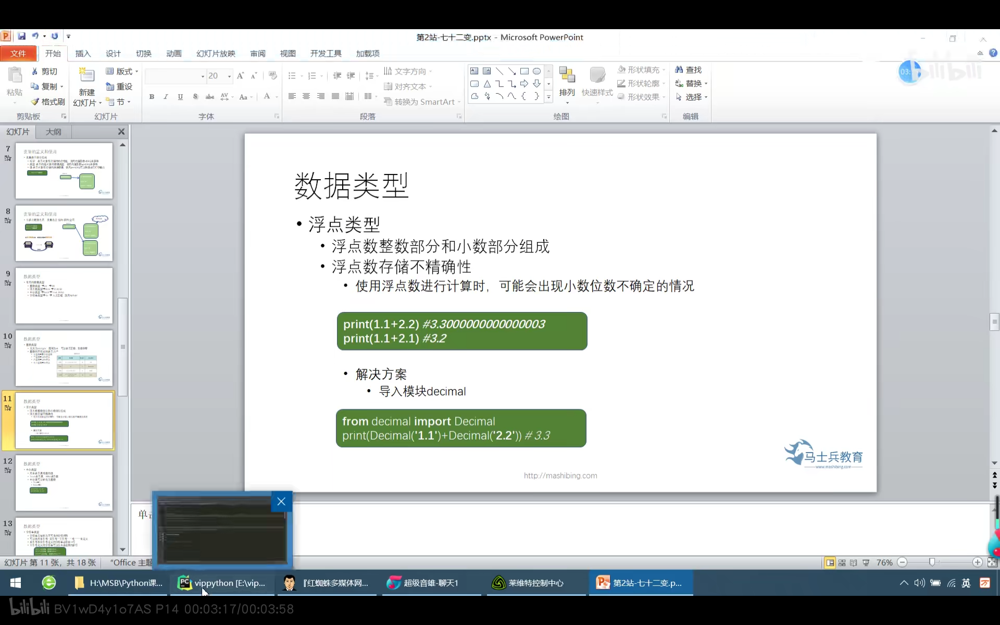
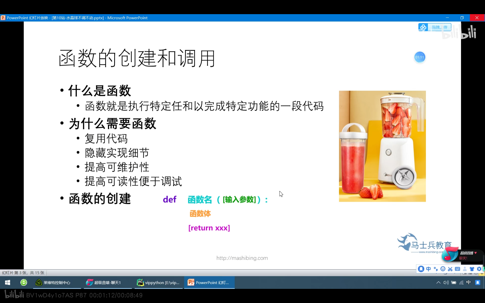
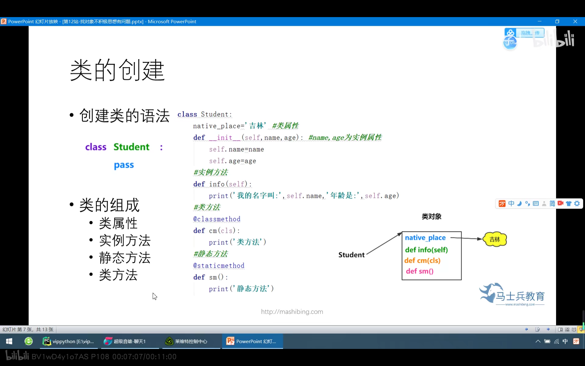

# Python_Learn

方便以后学习Python基本知识点和爬虫,框架等....

## 简介

Python之禅

> Python之禅 by Tim Peters
>
> 优美胜于丑陋（Python 以编写优美的代码为目标）
>
> 明了胜于晦涩（优美的代码应当是明了的，命名规范，风格相似）
>
> 简洁胜于复杂（优美的代码应当是简洁的，不要有复杂的内部实现）
>
> 复杂胜于凌乱（如果复杂不可避免，那代码间也不能有难懂的关系，要保持接口简洁）
>
> 扁平胜于嵌套（优美的代码应当是扁平的，不能有太多的嵌套）
>
> 间隔胜于紧凑（优美的代码有适当的间隔，不要奢望一行代码解决问题）
>
> 可读性很重要（优美的代码是可读的）
>
> 即便假借特例的实用性之名，也不可违背这些规则（这些规则至高无上）
>
> 不要包容所有错误，除非你确定需要这样做（精准地捕获异常，不写 except:pass 风格的代码）
>
> 当存在多种可能，不要尝试去猜测
>
> 而是尽量找一种，最好是唯一一种明显的解决方案（如果不确定，就用穷举法）
>
> 虽然这并不容易，因为你不是 Python 之父（这里的 Dutch 是指 Guido ）
>
> 做也许好过不做，但不假思索就动手还不如不做（动手之前要细思量）
>
> 如果你无法向人描述你的方案，那肯定不是一个好方案；反之亦然（方案测评标准）
>
> 命名空间是一种绝妙的理念，我们应当多加利用（倡导与号召）

## 基本概念	

### 1. Print函数的使用

- 功能: 项目地输出内容
- 输出内容:数字,字符串,表达式
- 目的地: iDLE 控制台 文件


```python
# -*- coding:utf-8 -*-
# B站课集: P5
# 开发时间: 2021/3/13 $ 14:59
# 输出数字
print(123)

# 输出字符串
print('李智恩')
print("李智恩")

# 输出运算符的表达式值
print(3 + 1)

# 将数据输出文件
# open方法用于创建文件,这一块会在模块化里接触到相关的用法
print(open("C:/Users/DUHAI/Desktop/aa.txt", 'a+'))

# 2.使用占位的方式
a1 = 2
# 2.1%d
print("输出数字:%d" % a1)
# 2.2%s
a2 = "李智恩"
print("最喜欢的歌手:%s" % a2)

# 2.3合并占位
print("我最喜欢的歌手%s,今年%d岁" % (a2, a1))  # 注:注意在字符串之后不能接逗号

# 3.多参传递
print("www", "baidu", "com", sep=".")
print("www2",end="\n")
```


### 2.转义字符和原字符

|    转义字符分类    | 要表示的字符 | 转义字符 |                 备注                  |
| :----------------: | :----------: | :------: | :-----------------------------------: |
| 无法直接表示的字符 |     换行     |    \n    |     newline光标移动到下一行的开头     |
|                    |     回车     |    \r    |      return光标移动到本行的开头       |
|                    |  水平制表位  |    \t    | tab键,光标移动到下一组4个空格的开头处 |
|                    |     退格     |    \b    |   键盘上的backsapce键,回退一个字符    |
|  有特殊语法的字符  |    反斜杠    |   \\\    |                                       |
|                    |    单引号    |   \\'    |                                       |
|                    |    双引号    |   \\"    |                                       |

```python
# -*- coding:utf-8 -*-
# B站课集: P6
# 开发时间: 2021/3/13 $ 15:00

# 1.转义字符
print("Hello\nPython!!!")  # newline为换行的意思,取了n字母表示换行 Hello Python!!!中间进行了换行
print("Hello\rPython!!!")  # Python!!! 光标置于此,输出之后的内容 Python!!!
print("Hello\tPython!!!")  # Hello	Python!!! 使用\t表在此进行了Tab键使用 Python!!!
print("Hello\bPython!!!")  # HellPython!!! 使用\b删除此之前的一个字符,就回退的意思
# 1.1
print("http://www.baidu.com")  # http://www.baidu.com
print("我最喜欢的歌手:\"李智恩\"")  # 我最喜欢的歌手:"李智恩"

# 2.原字符: 不希望字符串中的转义字符七作用,就还是要使用原字符,在字符串之前加上r或者R
print(r"Hello\tPython")  # Hello\tPython 作用其实还是蛮大的
```


### 3.二进制和编码字符


```python
# -*- coding:utf-8 -*-
# B站课集: P7
# 开发时间: 2021/3/13 $ 15:00

# 转换字符编码,可能需要高版本点的Python包
print(chr(0b100))
print(ord(''))

```


### 4.Python注释写法


```python
# -*- coding:utf-8 -*-
# B站课集: 
# 开发时间: 2021/3/13 $ 15:02

# 单行注释写法

"""
多行注释写法
"""

"""
中文编码格式
# coding:utf-8
"""
```


## 二. Python基础知识

### 0.标识符和保留字

```python
# -*- coding:utf-8 -*-
# B站课集: P8
# 开发时间: 2021/3/13 $ 15:01

# 查看所以的保留字
import keyword

print(keyword.kwlist)

```


### 1.变量定义和使用


```python
# -*- coding:utf-8 -*-
# B站课集: P10,11
# 开发时间: 2021/3/13 $ 14:31

# 1.变量边定义边赋值
a1 = "李智恩"
print(a1)

# 1.1判断变量的标识地址和类型与值
print("标识", id(a1))
print('类型', type(a1))
print('值', a1)

# 2.1变量的多次赋值
b1 = "李智恩"
b1 = "IU"
# 注:多次赋值之后会执行一个新的地址空间:与类C语言相似
print(b1)

```


### 2.基本数据类型

- 数值类型

  

  ```python
  # -*- coding:utf-8 -*-
  # B站课集: P11
  # 开发时间: 2021/3/13 $ 14:45
  
  # 1.整数类型 int => 98,0,-20
  a1 = 98
  a2 = 0
  a3 = -20
  # 打印数值
  print(a1, a2, a3)
  # 打印类型type()
  print(type(a1), type(a2), type(a3))
  
  # 1.1整数可以表示二进制,八进制,十进制,十六进制
  print("十进制", 12)
  print("二进制", 0b10100)  # 开头0b
  print("八进制", 0o176)  # 开头0o
  print("十六进制", 0x1EAF)  # 开头0x
  ```

  

- 浮点类型

  

  ```python
  # -*- coding:utf-8 -*-
  # B站课集: P13
  # 开发时间: 2021/3/13 $ 14:57
  
  # 1.浮点类型 float => 3.14159
  # 浮点值计算用法
  a1 = 3.14846465468468465
  a2 = 2.37546546516546465
  print(a1 + a2)  # 5.52393011985 计算值不对,出错
  
  # 2.1导入模块decimal
  from decimal import Decimal
  
  # 2.2使用方法Decimal
  print(Decimal("3.14846465468468465") + Decimal("2.37546546516546465"))  # 5.52393011985014930
  ```

  

- 布尔类型

  > True表示真,False表示假.
  >
  > True为1,False为0

  ```python
  # -*- coding:utf-8 -*-
  # B站课集: P12
  # 开发时间: 2021/3/13 $ 14:57
  
  # 1.布尔类型 bool =>True,False
  a1 = True
  a2 = False
  
  print(a1, type(a1))  # (True, <type 'bool'>)
  print(a2, type(a2))  # (False, <type 'bool'>)
  
  # 1.1布尔值进行数组计算
  print(a1 + 1)  # 这里计算会得到2,因为True被隐性转化为1
  
  ```

  

- 字符串类型

  

  ```python
  # -*- coding:utf-8 -*-
  # B站课集: P15
  # 开发时间: 2021/3/13 $ 14:58
  
  # 1.字符串类型 str => "不以物喜不以己悲"
  # 1.1单引号
  a1 = '最喜爱歌手:李智恩'
  print(a1)  # 最喜爱歌手:李智恩
  print(type(a1))  # <type 'str'>
  
  # 1.2双引号
  a2 = "最喜爱歌手:李智恩"
  print(a2)  # 最喜爱歌手:李智恩
  print(type(a2))  # <type 'str'>
  
  # 1.3三引号
  a3 = '''最喜爱歌手:
  李智恩'''
  print(a3)
  print(type(a3))  # <type 'str'>
  ```


### 3.内置函数

#### (一) 类型转换

| 函数名  |              作用              | 注意事项                                                     | 举例                         |
| :-----: | :----------------------------: | :----------------------------------------------------------- | ---------------------------- |
|  str()  | 将其他数据类型转化为字符串类型 | 也可用引号转换                                               | str(123) str(3.14)           |
|  int()  |  将其他数据类型转化为整数类型  | 1.文字,小数类字符串无法转整数<br />2.浮点数转化为整数,抹零取整 | int('123')<br />int(9.8)     |
| float() |  将其他数据类型转化为浮点类型  | 1.文字无法转化为整数<br />2.整数无法转化为浮点类型           | float('9.9')<br />flaot(9.9) |

```python
# -*- coding:utf-8 -*-
# B站课集: P16
# 开发时间: 2021/3/13 $ 14:58

# 1.1 str()
print("----------str函数------------------")
a1 = 3.12
a2 = 12
print(str(a1), type(a1))  # ('3.12', <type 'float'>)
print(str(a2), type(a2))  # ('12', <type 'int'>)
# 1.2 实例
name = "李智恩"
age = 28
print('我最喜欢歌手:' + name + ",今年" + str(age) + "岁")  # 我最喜欢歌手:李智恩,今年28岁 int类型将会通过str函数转化为str类型

# 2.1 int()
print("------------int函数-----------------")
b1 = "李智恩"
b2 = "12"
b3 = "3.14"
b4 = 3.14
# print(int(b1), type(b1))  # 出错
print(int(b2), type(b2))  # (12, <type 'str'>)
# print(int(b3), type(b3))   # 出错
print(int(b4), type(b4))  # (3, <type 'float'>)

# 3.1 float()
print("------------float函数-----------------")
c1 = "李智恩"
c2 = "12"
c3 = "3.14"
c4 = 99

# print(float(c1), type(c1))  # 出错
print(float(c2), type(c2))  # (12.0, <type 'str'>)
print(float(c3), type(c3))  # (3.14, <type 'str'>)
print(float(c4), type(c4))  # (99.0, <type 'int'>)
```

### (二) input函数

- 作用: 接收来自用户的填写
- 返回值类型: 输入值得类型为str
- 值得存储: 使用= 对输入的值进行存储

```python
# -*- coding:utf-8 -*-
# B站课集: P19
# 开发时间: 2021/3/13 $ 15:02

# 1.简单的输入
a1 = input("你最喜欢的歌手: ")
print(str(a1))

# 2.对输入的数据进行编码
b1 = input("输入第一个数字")
b2 = input("输入第二个数字")
print("两数之和是: ", (b1 + b2))
```

## 三. Python运算符

#### 常见运算符


#### 算术运算符

| 运算符 |        描述         |           实例           |
| :----: | :-----------------: | :----------------------: |
|   +    |     两对象相加      |          1+1=2           |
|   -    |     两对象相减      |          1-1=0           |
|   *    |     两对象相乘      |          1*1=1           |
|   /    |     两对象相除      |          1/1=1           |
|   %    | 取模-返回除法的余数 |          2/1= 1          |
|   **   | 幂运算:返回x的y次幂 |         8**2= 3          |
|   //   |      向下取整       | -9//2 = -5<br />9//2 = 4 |


```python
# -*- coding:utf-8 -*-
# B站课集: P21
# 开发时间: 2021/3/13 $ 15:02

# 1.加法运算符
print(1 + 1)

# 2.减法运算符
print(1 - 1)

# 3.乘法运算符
print(1 * 1)

# 4.减法运算符
print(1 / 1)

# 5.取余
print(1 // 1)  # 1

# 6.取整
print(1 % 1)  # 0

# 7.幂运算
print(1 ** 1)  # 1
```


#### 赋值运算符


```python
# -*- coding:utf-8 -*-
# B站课集: P22
# 开发时间: 2021/3/13 $ 15:03

# 1.赋值运算符 运算顺序从右边到左边
a1 = 1 + 2

# 1.2链式赋值运算
# 得到下面的结论,输出的标识都是相同的.
b1 = b2 = b3 = 20
print(b1, id(b1))  # (20, 42557872L)
print(b2, id(b2))  # (20, 42557872L)
print(b3, id(b3))  # (20, 42557872L)

# 2.支持参数赋值
c1 = 2

# 2.1加法
c1 += 2
print(c1)  # 4

# 2.2乘法
c1 *= 2
print(c1)  # 8

# 注:还有多种情况待以后列出
# 3.支持解构赋值
d1, d2, d3 = 10, 20, 30
print(d1, d2, d3)  # 10,20,30

# 3.1出现报错的情况
# d1, d2 = 10, 20, 30  # 因为左右两边变量的个数和值得个数不对应


# 4.交换变量
a, b = 1, 2
a, b = b, a
print(a, b)  # 2,1
```

#### 比较运算符


```python
# -*- coding:utf-8 -*-
# B站课集: P23
# 开发时间: 2021/3/13 $ 15:03

# 1.常用比较
a1 = 10
a2 = 20
print("a1>a2?", a1 > a2)  # False
print("a1>=a2?", a1 >= a2)  # False
print("a1<a2?", a1 < a2)  # True
print("a1<=a2?", a1 <= a2)  # True
print("a1!=a2?", a1 != a2)  # True

# 2.比较运算符 ==
"""
    = 表是赋值,== 表示赋值
    一个变量有三部分,变量名,赋值运算符,值
    那么 == 比较的是值还是标识id呢?
"""
b1 = 10
b2 = 10
print("b1==b2", b1 == b2)  # True 说明b1与b2的值相等 

# 3.比较标识id运算符 is
c1 = 10
c2 = 10
print("c1与c2的标识是否相等??", c1 is c2)  # True 说明c1与c2的标识相等

# 那么什么情况下会出现标识比较为False呢??
# 当内部标识不一样的情况下,这里是数组数据类型
d1 = [1, 2]
d2 = [1, 2]
print(d1 is d2)  # False
print(d1 is not d2)  # True 当对象标识id不相等时,返回True
```


#### 布尔运算符


```python
# -*- coding:utf-8 -*-
# B站课集: P24
# 开发时间: 2021/3/13 $ 15:04

# 1.and运算符 一假即假 
print(True and False) # False

# 2.or运算符 一真即真 
print(True and False) # True

# 3.not运算符 为真即假
print(not True) # False

# 4.in , not in运算符
d1 = "IU"
print("I" in d1) # True
print("A" not in d1) # False
```


#### 位运算符


#### 运算符优先级

> 优先级排布顺序: 0 => 算术运算符 => 位运算符 => 比较运算符 => 布尔运算符 =>赋值运算符 优先级从高到低


## 四. Python分支语句

#### 顺序结构

> 程序从上到下顺序执行代码,中间无任何判断和跳转,直到程序结束: 常见的一般输出语句

#### 单分支语句

> 语法结构:
> if 表达式:
> 	条件执行体

```python
# -*- coding:utf-8 -*-
# B站课集: P29
# 开发时间: 2021/3/13 $ 15:37

a1 = 10
money = int(input("请输入现有金额:"))

# 单分支语句
if a1 < money:
    print("我的钱有多")
```


#### 双分支语句

> 语法结构 :
> if 表达式:
> 	条件执行体
> else:
> 	条件执行体

```python
# -*- coding:utf-8 -*-
# B站课集: P30
# 开发时间: 2021/3/13 $ 15:38


a1 = 10
money = int(input("请输入现有金额:"))

# 单分支语句
if money > a1:
    print("我的钱有多")
else:
    print("钱少")
```


#### 多分支语句

> 语法结构:
> if 条件表达式:
> 	条件执行体
> elif 条件表达式:
> 	条件执行体
> else:
> 	条件执行体

```python
# -*- coding:utf-8 -*-
# B站课集: P30
# 开发时间: 2021/3/13 $ 15:38


a1 = 10
money = int(input("请输入现有金额:"))

# 单分支语句
if money > a1:
    print("我的钱有多")
elif 5 < money < a1:
    print("差点意思,钱较少")
else:
    print("钱少")
```


#### 嵌套if结构

> 语法结构:
> if 条件表达式:
> 	if 内置条件表达式:
> 		条件执行体
> 	else:
> 		条件执行体
> elif 条件表达式:
> 	条件执行体
> else:
> 	条件执行体


## 五. 循环语句

#### 三元表达式 if关键字

```python
# -*- coding:utf-8 -*-
# B站课集: P33
# 开发时间: 2021/3/13 $ 16:49

a1 = 10
a2 = 20
print("a1会大于a2?" if a1 > a2 else "a1不大于a2")  # a1不大于a2
```

#### pass语句

- 什么事都不干.只是个占位符,用在语法需要的地方
- 一般是在不知道此处代码该怎么写的时候,就使用pass语句
- 可以和那些语句使用能生效
  - if条件执行体
  - for - in语句的循环体
  - 定义函数时的函数体

```python
# -*- coding:utf-8 -*-
# B站课集: P34
# 开发时间: 2021/3/13 $ 16:50


a1 = 10
money = int(input("请输入现有金额:"))

# 单分支语句
if money > a1:
    pass
elif 5 < money < a1:
    pass
else:
    pass
```

#### range()内置函数

	- 用于生成一个整数序列
	- 创建range对象的三种方式
	- 返回值迭代对象
	- range优点
	- in与not in判断整数序列中是否存在(不存在)执行的整数


```python
# -*- coding:utf-8 -*-
# B站课集: P35
# 开发时间: 2021/3/14 $ 14:52

# 1.range()创建方式
# 1.1第一种:单参
a1 = range(10)  # 从0开始,步长为1
print(a1)  # [0, 1, 2, 3, 4, 5, 6, 7, 8, 9]

# 1.2第二种:双参
a2 = range(5, 10)  # 从5开始,步长为1
print(a2)  # [5, 6, 7, 8, 9]

# 1.3第三种:三参
a3 = range(2, 10, 2)  # 从2开始,步长为2
print(a3)  # [2, 4, 6, 8]

# 显式转换list()为整数序列
```


## 六. Python数组基础

#### 不可变序列和可变序列

- 不可变序列: 字符串 元组
  - 不可变序列: 没有增删改操作
- 可变序列: 列表 字典
  - 可变序列: 可以对序列执行增删改操作,对象地址不发生更改

| 数据结构    | 是否可变 |             是否重复             | 是否有序 |  定义符号   |
| :---------- | :------: | :------------------------------: | :------: | :---------: |
| 列表(list)  |   可变   |              可重复              |   有序   |     []      |
| 字典(dict)  |   可变   | key: 不可重复<br />value: 可重复 |   无序   | {key:value} |
| 元组(tuple) |  不可变  |              可重复              |   有序   |     ()      |
| 集合(set)   |   可变   |             不可重复             |   无序   |     {}      |


### 1.为什么需要列表

- 变量可以存储一个元素,而列表是一个"大容器"可以存储N多个元素,程序可以方便的对这些数据进行整体操作

- 列表相当于其他语言中的数组

- 列表包含索引,数据 示意图如下:

  | 索引 |   -3   |    -2    |  -1  |
  | :--- | :----: | :------: | :--: |
  | 数据 | "布袋" | "李智恩" | "IU" |
  | 索引 |   0    |    1     |  2   |

- 列表特点:

  - 列表元素按照顺序有序排布
  - 索引映射唯一一个数据
  - 列表可以存储重复数据
  - 任意数据类型可混存
  - 根据需要动态分配和回收内存

#### 列表的创建和使用

###### 内存调用指示图


```python
# -*- coding:utf-8 -*-
# B站课集: P46,47
# 开发时间: 2021/3/13 $ 17:00

# 1.创建对象
a1 = ["WHISTLE", "BOOMBAYAH", "PLAYING WITH FIRE"]
print(a1)  # ['WHISTLE', 'BOOMBAYAH', 'PLAYING WITH FIRE']
print(id(a1))  # 47703560
print(type(a1))  # <type 'list'>

# 1.2 创建对象的第二种方式: 使用内置函数
a2 = list(["WHISTLE", "BOOMBAYAH", "PLAYING WITH FIRE"])
print(a2)  # ['WHISTLE', 'BOOMBAYAH', 'PLAYING WITH FIRE']
```

#### 列表索引和元素获取

##### (一) 判断是否存在该值,存在则返回索引值

|                 | 如查询列表中,存在N个相同元素,只是返回相同元素中第一个元素的索引 |
| :-------------: | :----------------------------------------------------------: |
| index()函数使用 |      如查询的元素不在列表中存在,则会抛出错误ValueError       |
|                 |             还可以在指定的start和stop中进行查找              |


##### (二)获取列表元素

```python
# -*- coding:utf-8 -*-
# B站课集: P48,49
# 开发时间: 2021/3/13 $ 17:01

# 1.定义列表
a1 = ["WHISTLE", "BOOMBAYAH", "PLAYING WITH FIRE"]

# 1.1获取索引值为1的元素
print(a1[1])  # BOOMBAYAH

# 1.2获取索引值为-2的元素
print(a1[-2])  # BOOMBAYAH

# 注:当索引值不存在时,会出错:list index out of range
# print(a1[4])
```

####   同时获取元素多个值(切片)


```python
# -*- coding:utf-8 -*-
# B站课集: P50
# 开发时间: 2021/3/13 $ 17:02

# 1.定义数组,进行切片操作
a1 = ["WHISTLE", "BOOMBAYAH", "PLAYING WITH FIRE", "Lisa"]
# start:1,end:3,步长:2
print(a1[0:3:2])  # ['WHISTLE', 'PLAYING WITH FIRE']

# 1.2 无步长
print(a1[0:3:])  # ['WHISTLE', 'BOOMBAYAH', 'PLAYING WITH FIRE']

# 1.3 默认开始为0
print(a1[:3:2])  # ['WHISTLE', 'PLAYING WITH FIRE']

# 1.4 默认结束为len长度
print(a1[0::2])  # ['WHISTLE', 'PLAYING WITH FIRE']

# 1.5 步长为负数时
print(a1[::-2])  # ['Lisa', 'BOOMBAYAH']

# 1.6 开始值大于结束值时
print(a1[3::-2])  # ['Lisa', 'BOOMBAYAH']
print(a1[2::-2])  # ['PLAYING WITH FIRE', 'WHISTLE']
```


#### 列表的查询和循环

> 1. 判断指定元素是否存在:
>    	元素 in 列表名
>    	元素 not in 列表名
>
> 2. 列表元素的遍历
>    	for 迭代元素 in 列表名:
>    		操作表达式

```python
# -*- coding:utf-8 -*-
# B站课集: P51
# 开发时间: 2021/3/13 $ 17:03

# 1.定义列表
a1 = ["WHISTLE", "BOOMBAYAH", "PLAYING WITH FIRE", "Lisa"]

# 1.1使用in,not in关键词,而不是is
print("Lisa" in a1)  # True
print("lisa" in a1)  # False
print(11 in a1)  # False
print(11 not in a1)  # True
# 1.2使用for... in...函数
for a2 in a1:
    print(a2)  # 依次打印数组元素值

# 说明下is和in的区别之处在哪??

```


#### 操作列表元素方法

##### (一) 增加操作

| 方法/其他 |                                |
| :-------: | :----------------------------: |
| append()  |    在列表的末尾添加一个元素    |
| extend()  |  在列表的末尾至少添加一个元素  |
| insert()  |  在列表的任意位置添加一个元素  |
|   切片    | 在列表任意位置添加至少一个元素 |

```python
# -*- coding:utf-8 -*-
# B站课集: P52
# 开发时间: 2021/3/13 $ 17:03

# 1.定义数组
a1 = ["WHISTLE", "BOOMBAYAH", "PLAYING WITH FIRE", "Lisa"]

# 1.1使用append方法在末尾添加一个元素
a1.append("IU")  # 这里不需要去接收值,得到的数组是已经添加上去的
print(a1)

# 1.2使用extend方法在末尾至少添加一个元素
a2 = ["dushenyan", "lizhien"]
a1.extend(a2)  # 不添加任何值时会出现报错,extend() takes exactly one argument (0 givenS)
print(a1)

# 1.3使用insert方法在任意位置添加一个元素
a1.insert(1, "Suzy")  # 在索引值为1处添加裴秀智(Suzy)
print(a1)

# 1.4使用切片在任意位置添加至少一个元素
a3 = ["zhou", "en", "lai"]
a1[1:] = a3  # 在任意位置添加N个元素,后面的就忽略掉
print(a1)
```

##### (二) 删除操作

| 方法/其他 |              操作描述               |
| :-------: | :---------------------------------: |
| remove()  |          一次删除一个元素           |
|           |        重复元素只删除第一个         |
|           |     元素不存在则抛出valueError      |
|   pop()   |    删除一个指定索引位置上的元素     |
|           | 指定索引不存在则抛出错误valueError  |
|           | 不指定索引值,删除列表中最后一个元素 |
|   切片    |        一次至少删除一个元素         |
|  clear()  |              清空列表               |
|    del    |              删除列表               |

```python
# -*- coding:utf-8 -*-
# B站课集: P53
# 开发时间: 2021/3/13 $ 17:03

# 1.创建列表
a1 = ["WHISTLE", "BOOMBAYAH", "PLAYING WITH FIRE", "Lisa"]

# 1.1 remove(),传参,若是列表中存在的值,则会返回新列表
a1.remove("Lisa")
print a1  # ['WHISTLE', 'BOOMBAYAH', 'PLAYING WITH FIRE']

# 1.2 若不存在时,则会报错
# a1.remove("lisa") # ValueError: list.remove(x): x not in list

# 2.1 pop() 指定索引值,若存在则返回新列表
a1.pop(1)
# print(a1) # ['WHISTLE', 'PLAYING WITH FIRE']

# 2.2 若不存在,则报错
# a1.pop(3)  # IndexError: pop index out of range


# 3.1 切片操作
# 切是切了,但没有返回到真正的列表中
print a1[1:2]  # ['PLAYING WITH FIRE']

# 3.2 切片并且赋值操作
a1[1:2] = []
print a1  # 在['WHISTLE', 'PLAYING WITH FIRE']的基础上进行上面的运算

# 4.1 clear()清除列表中所以元素
# a1.clear()

# 5.1 del()将列表对象删除
# del a1
```

##### (三) 修改操作

- 一个是为指定索引的元素赋予一个新值
- 为指定的切片赋予新值

```python
# -*- coding:utf-8 -*-
# B站课集: P52
# 开发时间: 2021/3/13 $ 17:03

# 修改操作
a1 = ["WHISTLE", "BOOMBAYAH", "PLAYING WITH FIRE", "Lisa"]

# 1.1 通过索引值修改
a1[1] = "IU"
print a1  # ['WHISTLE', 'IU', 'PLAYING WITH FIRE', 'Lisa'],旧的值将会被修改掉

# 1.2 通过切片修改
a1[1:2] = ["dushenyan"]  # 在第二值和第三个值中替换掉IU为dushenyan  注:后面赋值为一个列表,而不是字符串
print a1  # ['WHISTLE', 'dushenyan', 'PLAYING WITH FIRE', 'Lisa']
```


##### (四) 排序操作

一般有下面两种方式:

- 调用sort方法,列中所有元素默认按照从小到大的顺序排序,可以指定reverse = True,进行降序和升序
- 调用内置函数sorted(),指定reverse = True,进行降序排序,原列表不发生改变

```python
# -*- coding:utf-8 -*-
# B站课集: P55
# 开发时间: 2021/3/13 $ 17:03

# 1.定义列表
a1 = [10, 69, 18, 45, 37, 83]

# 1.1 列表方法sort()默认从小到大排序,
a1.sort()
print(a1)  # [10, 18, 37, 45, 69, 83]

# 1.2 使用reverse = True时,从大到小排序
a1.sort(reverse=True)
print(a1)  # [83, 69, 45, 37, 18, 10]

# 2.1 sorted()内置函数进行排序,原列表不发生改变
print(sorted(a1))  # [10, 18, 37, 45, 69, 83]

# 2.2指定关键字
print(sorted(a1, reverse=True))  # [83, 69, 45, 37, 18, 10]
```

#### 列表生成列

简称: 生成列表的公式


```python
# -*- coding:utf-8 -*-
# B站课集: P56
# 开发时间: 2021/3/13 $ 17:04

# 1.列表生成列
# 基本用法
a1 = [i for i in range(1, 6)]
print a1

# 1.1 改变列表元素表达式
a2 = [i * i for i in range(1, 6)]
print(a2)
```

### 2.字典是什么

- Python内置的数据结构之一,与列表一样是一个可变序列
- 以键值对的方式存储数据,字典是一个无序序列

.png)

#### 字典创建和使用

```python
# -*- coding:utf-8 -*-
# B站课集: P59
# 开发时间: 2021/3/13 $ 17:05

# 1.字典的创建方式一:使用{}创建
a1 = {"name": "李智恩", "age": 28}

# 1.1字典创建方式二:使用关键字dict创建
a2 = dict(name="李智恩", age=28)
print(a2)

#  2.后续补充....
```

#### 字典有哪些特点呢?

	- 字典中所有元素都是一个key-value(键值对),key不允许重复使用,value可以重复使用
	- 字典中元是无规则排序的
	- 字典中key必须是不可变对象
	- 字典中根据使用动态收缩
	- 字典会浪费较大内存,是一种使用课件换时间的数据结构??

#### 字典的常用操作

##### (一) 获取字典中的元素

	- []: 中括号获取
	- get()方法: 传入键名

```python
# -*- coding:utf-8 -*-
# B站课集: P60
# 开发时间: 2021/3/16 $ 20:54

# 1.定义元组
a1 = dict(name="李智恩", age=28)

# 1.1使用[]获取键值名字
print(a1["name"])
# print(a1["李智恩"]) # keyError

# 1.2使用get()方法获取键值
print(a1.get("name"))
# print(a1.get("lizhien"))  # None
```

上述两种方式获取键值得区别:

- [] 如果字典中不存在指定的key,则会出现keyError异常\
- get()取值,如果字典中不存在指定的key值,并不会抛出keyError而是返回None,可以通过参数设置默认的value,以便指定的key不存在是返回 

##### (二) Key值得判断

- in关键字: 指定的key在字典中存在返回True
- not in关键字: 指定的key在字典中不存在是返回True\

```python
# -*- coding:utf-8 -*-
# B站课集:P61
# 开发时间: 2021/3/16 $ 21:07

# 1.定义字典
a1 = {"name": '李智恩', "age": 28}

print("name" in a1) # True
print("李智恩" not in a1) # True
```

##### (三) 字典元素的增删改

```python
# -*- coding:utf-8 -*-
# B站课集: P62
# 开发时间: 2021/3/16 $ 21:09

# 1.定义字典
a1 = dict(name="李智恩")

# 2.1删除操作
del a1["name"]
print(a1)  # {}

# 2.2新增操作
a1["name"] = "IU"
a1["age"] = 28
print(a1)  # {'name': 'IU', 'age': 28}

# 2.3修改操作
a1["name"] = "李智恩"
print(a1)  # {'name': '李智恩', 'age': 28}

# 3.清空字典元素
a1.clear()
print(a1)  # {}
```

##### (四) 获取字典视图

以下三种方法:

- keys(): 获取字典中所有的key
- values(): 获取字典中所有的value
- items(): 获取字典中所有key,value对

```python
# -*- coding:utf-8 -*-
# B站课集: P62
# 开发时间: 2021/3/16 $ 21:23

# 1.创建字典
a1 = {"name": "李智恩", "age": 28}

# 1.1获取keys值
print(a1.keys())  # dict_keys(['name', 'age'])
print(type(a1.keys()))  # <class 'dict_keys'>
print(list(a1.keys()))  # ['name', 'age']
# 注:上述两条语句,后面的也可使用

# 1.2获取value值
print(a1.values())  # dict_values(['李智恩', 28])

# 1.3 获取键值对
print(a1.items())  # dict_items([('name', '李智恩'), ('age', 28)])
```

#### 字典元素遍历

> 语法结构:
> 	for item in items:
> 		print(item)

```python
# -*- coding:utf-8 -*-
# B站课集: P63
# 开发时间: 2021/3/16 $ 21:30

a1 = {"name": "李智恩", "age": 28}

# 1.for..in遍历操作
for item in a1:
    print(item,a1.get(item))
```

#### 字典生成列


```python
# -*- coding:utf-8 -*-
# B站课集: P65
# 开发时间: 2021/3/16 $ 21:40

keys = ["name", "age"]
items = ["李智恩", 28]
a1 = {keys.upper(): items for keys, items in zip(keys, items)}
print(a1)
```

### 3.元组是什么

> Python内置数据结构之一,是一个不可变序列

#### 元组的创建和使用

```python
# -*- coding:utf-8 -*-
# B站课集: P67
# 开发时间: 2021/3/17 $ 11:01

# 1.创建元组
# 1.1使用括号创建
a1 = ('李智恩', "Lisa", "WISHTLE")
print(a1)  # ('李智恩', 'Lisa', 'WISHTLE')
# 1.2省略小括号的方式
a11  = '李智恩', "Lisa", "WISHTLE"
print(a11)

# 2.只包含一个元组元素需要使用逗号和小括号,不然就不会是元组元素
a2 = ("李智恩",)
print(a2)

# 3.使用tuple()函数创建
a3 = tuple(("李智恩", "Lisa", "WISHTLE"))  # 注: 内部嵌套另外一括号
print(a3)  # ('李智恩', 'Lisa', 'WISHTLE')

# 4.获取元组元素的方式
a4  = '李智恩', "Lisa", "WISHTLE"
print(a4[2])  # WISHTLE
```

#### 为什么将元组设计为不可变序列

- 在多任务环境下,同时操作对象时不需要加锁

- 因此,在程序中尽量使用不可变序列

  元组存储的是对象的引用:

  - 如果元组中对象本身不可变对象,则不能引用其他对象
  - 如果元组中对象时可变对象,则可变对象的引用不允许改变,但数据可改变

#### 元组的遍历

- 元组是可迭代对象,所以可使用for...in进行遍历

```python
# -*- coding:utf-8 -*-
# B站课集: P69
# 开发时间: 2021/3/17 $ 11:19

# 1.创建元组
a1 = "李智恩", "Lisa", "杜审言", "Kobe"
# 遍历
for item in a1:
    print(item)
```


### 4.集合是什么

- Python内部提供的数据类型
- 与列表, 字典一样都是属于可变类型的序列
- 集合是没有value的字典

#### 集合的创建和使用

```python
# -*- coding:utf-8 -*-
# B站课集: P70
# 开发时间: 2021/3/17 $ 11:00

# 创建集合的方式一: 使用{}
a1 = {"name", "age", "love"}
print(a1)  # {'love', 'age', 'name'}  集合内部元素不允许重合

# 方式二: 内置函数set
a2 = set(range(6))
print(a2)  # {0, 1, 2, 3, 4, 5}

print(set(("name", 'age')))  # {'age', 'name'}
print(set(["李智恩", 28]))  # {'李智恩', 28}
print(set({"name", "age"}))  # {'age', 'name'}
print(set("李智恩"))  # {'智', '恩', '李'}
print(set())  # set()
```

#### 集合相关操作

##### (一) 集合元素判断操作

- in或not in

(二) 集合元素增加操作

- 调用aad()方法: 一次添加一个元素
- 调用update()方法: 一次添加多个元素

(三) 集合删除操作

- 调用remove()方法: 一次删除一个指定元素,如果不存在抛出错误
- 调用discard()方法: 一次删除一个指定元素.如果不存在不抛出错误
- 调用pop()方法: 一次只删除一个任意元素
- 调用clear()方法: 清空集合对象

```python

```

#### 集合之间的关系

- 两结合是否相等
  - 使用运算符 == 或者 !=进行判断
- 一个集合是否是另一个集合的子集
  - 调用方法: issubset()进行判断
- 一个集合是否是另一个集合的超集
  - 调用方法: issuperset()进行判断
- 两集合是否有交集
  - 调用方法: isdisjoint进行判断

[集合 - 维基百科，自由的百科全书 (wikipedia.org)](https://zh.wikipedia.org/wiki/集合)

#### 集合生成列

```python
# -*- coding:utf-8 -*-
# B站课集: P74
# 开发时间: 2021/3/17 $ 11:46

# 集合生成式
a1 = {i*i for i in range(6)}
print(a1)
```


## 七. Python字符串操作	

#### 字符串和字符串驻留机制是什么


```python

```


## 八.Python错误分析


## 九. Python函数基础

#### 函数的定义和调用

> 函数的执行顺序是怎么样的?
>
> 	- 有查看到函数被调用
> 	- 调到定义函数的函数体内
> 	- 执行函数体
> 	- 调到函数的调用处
> 	- 继续执行下一条语句



```python
# -*- coding:utf-8 -*-
# B站课集: P86
# 开发时间: 2021/3/13 $ 17:16

# 创建函数体
def A1(a1, a2):
    return a1 + a2

# 调用函数
a1 = A1(1, 2)
print a1
```


#### 函数参数传递

- 位置实参: 根据实参位置进行实参传递
- 关键字实参: 根据形参名称进行实参传递

```python
# -*- coding:utf-8 -*-
# B站课集: P87
# 开发时间: 2021/3/13 $ 17:17

def calc(a1, a2):  # 形式参数,形参位置是函数定义处
    return a1 > a2


result1 = calc(2, 1)  # 实参按照依次位置传递
print result1  # True

result2 = calc(a2=2, a1=1)  # 实参按照形参名称传递
print result2  # False
```


#### 函数内存分析

#### 函数返回值

```python
# -*- coding:utf-8 -*-
# B站课集: P89
# 开发时间: 2021/3/13 $ 17:18

# 计算奇数和偶数,并且返回
def a1(num):
    old = []
    even = []
    for i in num:
        if i % 2:
            old.append(i)
        else:
            even.append(i)
    return old, even


print(a1([10, 29, 34, 12, 16, 75, 99]))  # ([29, 75, 99], [10, 34, 12, 16]) 返回的是一个元组数据()

"""
    函数返回值:
        如果函数无返回值,return 可以不用写
        如果函数有一个返回值,直接返回类型值
        如果函数有多个返回值,则会返回元组类型数据
"""
```


#### 函数默认形参

```python
# -*- coding:utf-8 -*-
# B站课集: P90
# 开发时间: 2021/3/13 $ 17:19

# 1.函数默认形参写法
def calc(a1, a2=10):
    return a1, a2


# 1.1传入单个实参
print(calc(20))  # (20, 10)

# 1.2传入多个实参
print(calc(10, 100))  # (10, 100)
```


#### 个数可变的位置形参和关键字形参


## 十. Python面向对象

#### 面向过程和面向对象的的区别

[面向对象 - 维基百科，自由的百科全书 (wikipedia.org)](https://zh.wikipedia.org/wiki/面向对象)


#### 面向对象中类的概念

[面向对象程序设计 - 维基百科，自由的百科全书 (wikipedia.org)](https://zh.wikipedia.org/wiki/面向对象程序设计)

#### 定义Python中的类



```python
# -*- coding:utf-8 -*-
# B站课集: P107
# 开发时间: 2021/3/13 $ 17:24

# 定义全局变量name:IU
name = "IU"


# 创建类,类名首字母大写,其余小写
class A1:
    name = "李智恩"  # 定义类属性
    age = 28  # 定义实例属性

    def __init__(self, name, age):
        self.name = name
        self.age = age

    # 实例方法
    def sayName(self):
        return self.name

    # 类方法
    @classmethod
    def sayAge(cls):
        return cls.age

    # 静态方法
    @staticmethod
    def sayStatic():
        print("我是静态方法")


# 类之外定义的称为函数,在类之内定义的称为方法
def sayName():
    return name
```

#### 了解类属性, 类方法, 静态方法

- 类属性: 类中方法外的变量称为类属性,被该类的所有对象所共享
- 类方法: 使用@classmethod修饰的方法,使用类名直接访问方法
- 静态方法: 使用@staticmethod修饰的主法,使用类名直接访问的方法


#### 对象的创建和使用

[静态方法 (计算机科学) - 维基百科，自由的百科全书 (wikipedia.org)](https://zh.wikipedia.org/wiki/方法_(電腦科學))

```python
# -*- coding:utf-8 -*-
# B站课集: P108
# 开发时间: 2021/3/13 $ 17:24

# 定义全局变量name:IU
name = "IU"


# 创建类,类名首字母大写,其余小写
class A1:
    name = "李智恩"  # 定义类属性
    age = 28  # 定义实例属性

    def __init__(self, name, age):
        self.name = name
        self.age = age

    # 实例方法
    def sayName(self):
        return self.name

    # 类方法
    @classmethod
    def sayAge(cls):
        return cls.age

    # 静态方法
    @staticmethod
    def sayStatic():
        return "我是静态方法"


# 类之外定义的称为函数,在类之内定义的称为方法
def sayName():
    return name


print(sayName())  # IU

# 创建A1类的实例对象
a1 = A1("李智恩", 21)
print(a1)  # <__main__.A1 object at 0x00000280CD566FD0>
print(id(a1))  # 2752224063440
print(type(a1))  # <class '__main__.A1'>

print(a1.sayName())  # 李智恩

# 获取A1类的id,type
print(A1)  # <class '__main__.A1'>
print(id(A1))  # 2752217924352
print(type(A1))  # <class 'type'>

print(A1.sayAge())  # 28
print(A1.sayStatic())  # 我是静态方法
```


#### 动态赋值属性和方法

```python
# -*- coding:utf-8 -*-
# B站课集: P111
# 开发时间: 2021/3/13 $ 17:26

# 定义A1类
class A1:
    name = "李智恩"

    def __init__(self, name):
        self.name = name


# 1.动态绑定属性
a1 = A1("IU")
a1.age = 24
print(a1.name, a1.age)  # IU 24


# 2.动态绑定方法
def sayName():
    return "我是动态赋值的方法"

a1.sayName = sayName; # 我是动态赋值的方法
print(a1.sayName())
```

#### 面向对象三大特性

- ##### 封装: 提高程序安全性

  - 将数据(属性)和行为(方法)包装到类对象中,在方法内部对属性进行操作,在类对象外部调用方法.这样无需关心内部具体实现细节,从而隔离复杂度
  - 在Python中没有专门修饰符用于属性私有,如果该属性不希望在类对象外部被访问,前边使用两个"_".专业

  ```python
  # -*- coding:utf-8 -*-
  # B站课集: 
  # 开发时间: 2021/3/17 $ 14:31
  
  class A1:
      name = "李智恩"
      age = 21
  
      def __init__(self, name, age):
          self.name = name;
          self.__age = age  # 年龄加上了两个__,不允许在类的外部使用
  
  
  a1 = A1("IU", 28)
  print(a1.name)  # IU
  # print(a1.__age) # 报错,不能使用__访问到"28' A1' object has no attribute '__age'
  
  # 那怎么能访问到呢??
  print(dir(a1))
  # 查看到类中所有的内部属性和方法
  print(a1._A1__age)  # 28 在类的外部通过 _A1__age 进行访问 君子行为.不是很允许你这么做
  ```

- ##### 继承: 提高代码复用性

  ```python
  # -*- coding:utf-8 -*-
  # B站课集: P113
  # 开发时间: 2021/3/17 $ 14:32
  
  # 1.定义父类
  class Person:
      name = "李智恩"
      age = 21
  
      def __init__(self, name, age):
          self.name = name
          self.age = age
  
      def sayName(self):
          return "我喜欢的歌手: " + self.name
  
  
  # 2.定义子类
  class Son(Person):
      work = "model"
  
      def __init__(self, name, age, work):
          super().__init__(name, age)
          self.work = work
  
  
  # 3.创建实例对象
  son = Son("IU", 21, "singer")
  print(son.sayName())  # 子类调用父类方法,执行返回了 我喜欢的歌手: IU
  ```

  ##### 说到了继承,就得说下方法重写.

  - 在子类对继承自父类的某个属性或方法不满时,可以在子类中对其方法体进行重新编写
  - 子类重写后的方法中可以通过super().XXX()调用父类中被重写的方法

  ```python
  # -*- coding:utf-8 -*-
  # B站课集: P114
  # 开发时间: 2021/3/17 $ 14:32
  
  # 1.定义父类
  class Person:
      name = "李智恩"
      age = 21
  
      def __init__(self, name, age):
          self.name = name
          self.age = age
  
      def sayName(self):
          return "我喜欢的歌手: " + self.name
  
  
  # 2.定义子类
  class Son(Person):
      work = "model"
  
      def __init__(self, name, age, work):
          super().__init__(name, age)
          self.work = work
          
      def sayName(self):
          # super().sayName();
          return "我喜欢的" + self.work + ": " + self.name
  
  
  # 3.创建实例对象
  son = Son("IU", 21, "歌手")
  print(son.sayName())  # 子类重写父类方法,执行返回了 我喜欢的模特: IU
  ```

  

- ##### 多态: 具有多种形态

  - 即便不知道一个变量所引用的对象到底是什么类型,仍然可通过这个变量调用方法,在运行过程中根据变量所引用对象类型,动态调用那个对象的方法

  ```python
  
  ```


## 十一. Python模板使用

#### 模板是什么

- 模板英文翻译: modules
- 函数和模板关系: 一个模板中可以包含N多个函数 N多个类 N多个变量
- 在Python中一个文件就被称为是一个模板

模板好处

- 方便其他程序和脚本的导入并使用
- 避免函数名和变量名冲突
- 提高代码可维护性
- 提高代码的可重用性

#### 自定义模块

创建自定义模块: 新建.py文件, 名称尽量不要与Python内置标准模板名称重名

​	这里的操作并不用写代码,鼠标右击出现选项 => 标记目录为 => 源码 根,右击目录内的文件就变为全部导出文件

导入模块操作:

> import模块名称 [as 别名]
>
> from 模块名称 import 函数/变量/类

```python
# -*- coding:utf-8 -*-
# B站课集: P121
# 开发时间: 2021/3/13 $ 17:27

# 1.别名导入
# 将math函数换成了cos
import math as Math

print(dir(Math))
print(Math.pi)  # 得到π数

# 2.使用from ... import ...
from math import pi

print(pi)  # 得到π数
```


#### 以主程序形式运行

- 每个模板定义中都包含一个记录模板的变量__ __name__ __,程序可以检查该变量以确定他们那个模板运行. 
- 如果一个模板不是被导入其他程序中执行,那么他可能在解释器的顶级模板中执行
- 顶级模板的__ __name__ __变量值变为__ __ __main__ __


#### Python中包使用

- 避免模块名重复
- 包含__ __init__ __.py文件


#### Python常用模板

| 模板名   | 描述                                                        |
| -------- | ----------------------------------------------------------- |
| sys      | 与Python解释器及其环境相关的标准库                          |
| time     | 提供时间相关的各种函数的标准库                              |
| os       | 提供了访问操作系统服务功能的标准库                          |
| calendar | 提供与日期相关的各种函数标准库                              |
| urllib   | 用来读取来自服务器的数据标准库                              |
| json     | 用来使用JSON序列化和反序列化对象                            |
| re       | 用来在字符串中执行正则表达式匹配和替换                      |
| math     | 提供标准算术运算函数的标准库                                |
| decimal  | 用来进行精确控制运算精度,有效位数和四舍五入操作的十进制运算 |
| logging  | 提供灵活的记录事件, 错误, 警告和调试信息等日志信息的功能    |


#### Python中第三方模块安装及其使用

第三方安装命令: pip install 模板名

## 十二. Python内置模板

#### 编码格式: 记事本ANSI格式便不会报错


#### 文件读写原理


```python
# -*- coding:gbk -*-
# B站课集: P127
# 开发时间: 2021/3/15 $ 14:50

a1 = open("./static/text.txt", "r")
print(a1.readlines())
a1.close()
```


#### 文件对象常用打开模式

文件类型: 

- 文本文件: 存储的是普通"字符"文本,默认unicode字符集,可以使用记事本打开
- 二进制文件: 数据内容用"字节"进行存储,无法使用记事本打开.例如:图片,音频,视频

打开模式:

| 打开模式 | 描述                                                         |
| -------- | ------------------------------------------------------------ |
| r        | 以只读模式,文件指针放在文件开头                              |
| w        | 只写模式打开文件, 文件不存在则创建,存在的话则覆盖之前内容,文件指针在文件开头 |
| a        | 追加模式打开, 如果文件不存在则创建,文件指针在开头,如果文件存在,文件指针在末尾 |
| b        | 二进制方式打开文件,不能单独使用,需要与其他模式一起使用,  rb wb |
| +        | 读写方式打开文件,不能单独使用,需要与其他模式一起使用  a+     |


#### 文件对象常用方法


#### with语句(上下文管理器)


#### 目录操作

- os模块是Python内置的操作系统功能和文件系统相关模块,该模块中语句的执行结果通常与操作系统有关,在不同操作系统上运行,得到的结果可能不同

- os模块与os.path模块用于对目录或文件进行操作

  ###### os相关函数

  | 函数                            | 描述                           |
  | ------------------------------- | ------------------------------ |
  | getcwd()                        | 返回当前工作目录               |
  | listdir(path)                   | 返回指定路径下的文件和目录信息 |
  | mkdir(path[,mode])              | 创建目录                       |
  | makedirs(path1/path2...[,mode]) | 创建多级目录                   |
  | rmdir(path)                     | 删除目录                       |
  | removedirs(path1/path2....)     | 删除多级目录                   |
  | chdir(path)                     | 将path设置当前工作目录         |

```python
# -*- coding:utf-8 -*-
# B站课集: P131
# 开发时间: 2021/3/15 $ 14:51

import os

# 打开记事本
# os.system("notepad.exe")

# 打开计算器
# os.system("calc.exe")

# 直接调用程序路径地址
os.startfile("https:\\www.tutorialspoint.com\\python\\index.html")
```


###### os.path模块操作目录相关函数

| 函数            | 说明                                                  |
| --------------- | ----------------------------------------------------- |
| abspath(path)   | 获取文件和目录的绝对路径                              |
| exists(path)    | 判断文件或目录是否存在,如果存在返回True,否则返回False |
| join(path,name) | 将目录和其他目录和文件名拼接起来                      |
| splitext()      | 分离文件名和扩展名                                    |
| basename(path)  | 从一个目录名提取文件名                                |
| dirname(path)   | 从一个路径提取文件路径,不包括文件名                   |
| isdir(path)     | 判断是否为路径                                        |


## 注: 相关链接

[Python教程 - 廖雪峰的官方网站 (liaoxuefeng.com)](https://www.liaoxuefeng.com/wiki/1016959663602400)

[Python官网](https://www.python.org/)

[Python 教程 — Python 2.7.18 .](https://docs.python.org/zh-cn/2.7/tutorial/index.html)

[Python Tutorial - Tutorialspoint](https://www.tutorialspoint.com/python/index.htm)

[Python | 李文周的博客 (liwenzhou.com)](https://www.liwenzhou.com/categories/Python/)

[PyPI · The Python Package Index](https://pypi.org/)

[Anaconda | The World's Most Popular Data Science Platform](https://www.anaconda.com/)

[Python 中文学习大本营 (pythondoc.com)](http://www.pythondoc.com/)